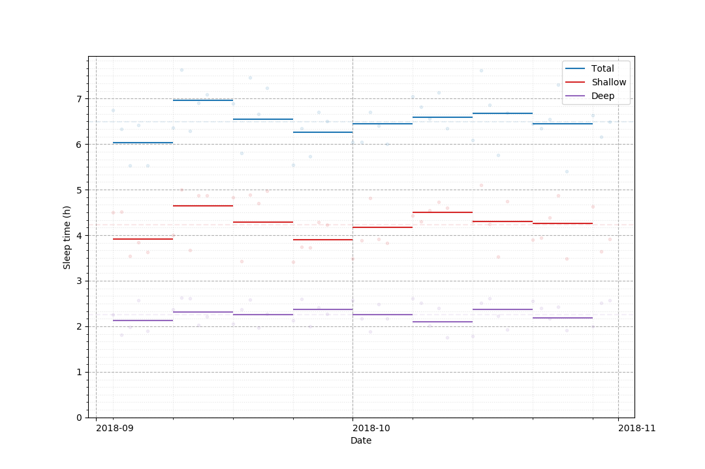

# mi-band-sleep-data-plotter

Plot the sleep data exported by the [Mi Fit application](https://play.google.com/store/apps/details?id=com.xiaomi.hm.health) (tested with version 4.0.7).

The main motivation for developing this tool is to have a simple way to analyse workdays sleep data, by offering the possibility to **exclude weekends sleep data**.

## Output example

Using the pseudo-randomly generated data in [example.csv](docs/example.csv), the tool generates the following plot:

```
(venv) $ python main.py --after 2018-09-01 --before 2018-11-01 --exclude-weekends docs/example.csv docs/example.png
```



## Installation

### 0. Requirements

* [Python](https://www.python.org/) (tested with version 3.6)

### 1. Install

```
(venv) $ pip install -r requirements.txt
```

## Usage

```
(venv) $ python main.py $SLEEP_DATA_CSV_FILE_PATH $OUTPUT_PNG_FILE_PATH [--after YYYY-MM-DD] [--before YYYY-MM-DD] [--exclude-weekends]
```
